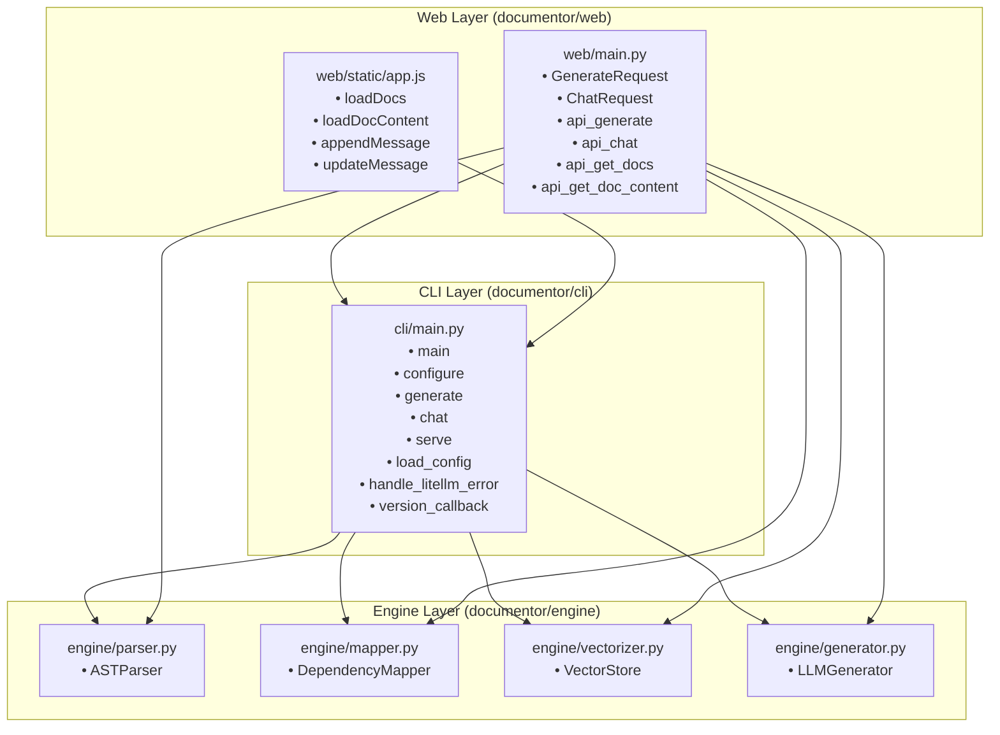

# Architecture Documentation: Documentor

This document provides an overview of the system architecture, file structure, key entities, and module dependencies for the `documentor` codebase based on its dependency graph.

---

## 1. System Overview

The `documentor` application is organized into three distinct layers:
1. **Engine Layer (`documentor/engine/`)**: Provides core processing utilities including parsing, vector storage, dependency mapping, and LLM text generation.
2. **CLI Layer (`documentor/cli/`)**: Provides the command-line interface and core execution commands (`generate`, `chat`, `serve`, `configure`).
3. **Web Layer (`documentor/web/`)**: Provides HTTP API endpoints and frontend assets to serve documentation and interact with the engine and CLI tools.

---

## 2. Component Structure & Entities

### 2.1 Engine Layer (`documentor/engine/`)
The engine layer contains isolated domain logic and has zero dependencies on other layers in the system.

* **`documentor/engine/parser.py`**
  * **Entities**: `ASTParser`
  * **Dependencies**: None
* **`documentor/engine/mapper.py`**
  * **Entities**: `DependencyMapper`
  * **Dependencies**: None
* **`documentor/engine/vectorizer.py`**
  * **Entities**: `VectorStore`
  * **Dependencies**: None
* **`documentor/engine/generator.py`**
  * **Entities**: `LLMGenerator`
  * **Dependencies**: None
* **`documentor/engine/__init__.py`**
  * **Entities**: `__init__.py`
  * **Dependencies**: None

### 2.2 CLI Layer (`documentor/cli/`)
The CLI layer acts as an entry point for command-line execution and interacts directly with all core engine modules.

* **`documentor/cli/main.py`**
  * **Entities**: `version_callback`, `main`, `load_config`, `handle_litellm_error`, `configure`, `generate`, `chat`, `serve`
  * **Dependencies**:
    * `documentor/engine/parser.py`
    * `documentor/engine/mapper.py`
    * `documentor/engine/vectorizer.py`
    * `documentor/engine/generator.py`
* **`documentor/cli/__init__.py`**
  * **Entities**: `__init__.py`
  * **Dependencies**: None

### 2.3 Web Layer (`documentor/web/`)
The web layer exposes the core documentation features via API endpoints and web client scripts.

* **`documentor/web/main.py`**
  * **Entities**: `GenerateRequest`, `ChatRequest`, `api_generate`, `api_chat`, `api_get_docs`, `api_get_doc_content`
  * **Dependencies**:
    * `documentor/engine/parser.py`
    * `documentor/engine/mapper.py`
    * `documentor/engine/vectorizer.py`
    * `documentor/engine/generator.py`
    * `documentor/cli/main.py`
* **`documentor/web/static/app.js`**
  * **Entities**: `loadDocs`, `loadDocContent`, `appendMessage`, `updateMessage`
  * **Dependencies**:
    * `documentor/cli/main.py`
* **`documentor/web/__init__.py`**
  * **Entities**: `__init__.py`
  * **Dependencies**: None

---

## 3. Architecture & Dependency Diagram

The following Mermaid diagram illustrates the dependency flow across the codebase:

---

## 4. Dependency Summary Matrix

| Source File | Engine Layer | CLI Layer | Web Layer |
| :--- | :---: | :---: | :---: |
| `documentor/engine/*` | **Self-Contained** | No Dependency | No Dependency |
| `documentor/cli/main.py` | Depends On | **Self-Contained** | No Dependency |
| `documentor/web/main.py` | Depends On | Depends On | **Self-Contained** |
| `documentor/web/static/app.js` | No Direct Dependency | Depends On | **Self-Contained** |