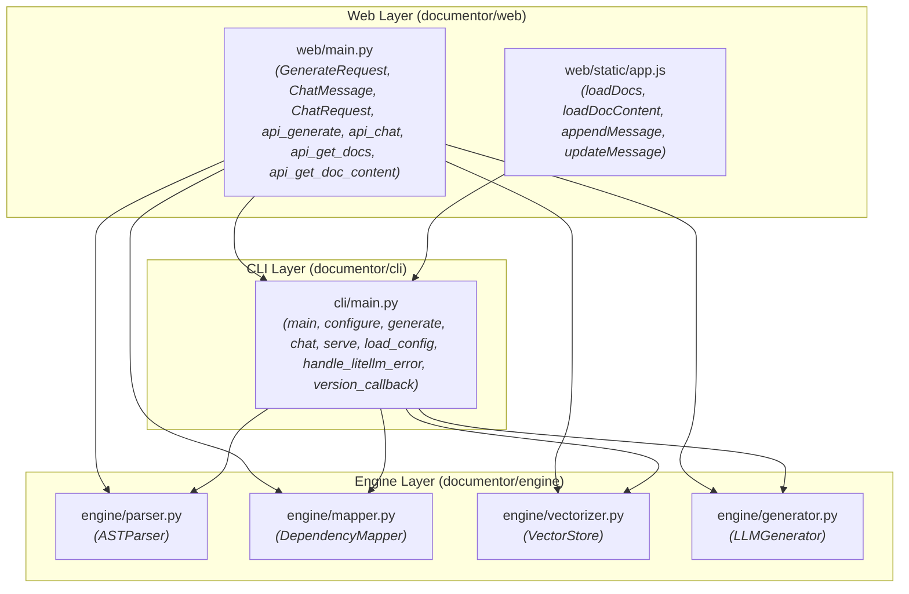

# System Architecture: `documentor`

This document details the architectural structure and module dependencies of the `documentor` codebase, derived directly from the code dependency analysis.

---

## Architecture Overview

The codebase is organized into three primary architectural layers:

1. **Engine Layer (`documentor/engine/`)**: Core logic components providing low-level operations such as AST parsing, dependency mapping, vector storage, and LLM text generation.
2. **CLI Layer (`documentor/cli/`)**: Command-line interface orchestration handling user configuration, error management, and invocation of core engine operations.
3. **Web Layer (`documentor/web/`)**: Web endpoints, request models, and static web frontend components for user interactions via a web interface.

---

## Component Breakdown

### 1. Engine Layer (`documentor/engine/`)
Contains standalone utility classes that handle processing and vector/LLM generation tasks.

* **`documentor/engine/parser.py`**
  * **Key Entity**: `ASTParser`
  * **Role**: Parses Abstract Syntax Trees from source files.
* **`documentor/engine/mapper.py`**
  * **Key Entity**: `DependencyMapper`
  * **Role**: Maps code dependencies across files.
* **`documentor/engine/vectorizer.py`**
  * **Key Entity**: `VectorStore`
  * **Role**: Manages vector storage and indexing operations.
* **`documentor/engine/generator.py`**
  * **Key Entity**: `LLMGenerator`
  * **Role**: Generates documentation/text responses using LLM integrations.

---

### 2. CLI Layer (`documentor/cli/`)
Acts as a central execution interface coordinating between configuration settings and engine utilities.

* **`documentor/cli/main.py`**
  * **Key Entities**: 
    * Functions: `main`, `configure`, `generate`, `chat`, `serve`, `version_callback`
    * Helper functions: `load_config`, `handle_litellm_error`
  * **Dependencies**:
    * `documentor/engine/parser.py`
    * `documentor/engine/mapper.py`
    * `documentor/engine/vectorizer.py`
    * `documentor/engine/generator.py`

---

### 3. Web Layer (`documentor/web/`)
Provides web API endpoints and frontend interface scripts to interact with the documentation engine and CLI modules.

* **`documentor/web/main.py`**
  * **Key Entities**:
    * Data Models: `GenerateRequest`, `ChatMessage`, `ChatRequest`
    * API Endpoints: `api_generate`, `api_chat`, `api_get_docs`, `api_get_doc_content`
  * **Dependencies**:
    * `documentor/cli/main.py`
    * `documentor/engine/parser.py`
    * `documentor/engine/mapper.py`
    * `documentor/engine/vectorizer.py`
    * `documentor/engine/generator.py`

* **`documentor/web/static/app.js`**
  * **Key Entities**:
    * Frontend Functions: `loadDocs`, `loadDocContent`, `appendMessage`, `updateMessage`
  * **Dependencies**:
    * `documentor/cli/main.py`

---

## Dependency Graph Diagram

The following Mermaid diagram maps the dependency hierarchy across the system components:

---

## Module Dependency Summary Table

| Module Source | Target Dependency |
| :--- | :--- |
| `documentor/cli/main.py` | `documentor/engine/parser.py` |
| `documentor/cli/main.py` | `documentor/engine/mapper.py` |
| `documentor/cli/main.py` | `documentor/engine/vectorizer.py` |
| `documentor/cli/main.py` | `documentor/engine/generator.py` |
| `documentor/web/main.py` | `documentor/cli/main.py` |
| `documentor/web/main.py` | `documentor/engine/parser.py` |
| `documentor/web/main.py` | `documentor/engine/mapper.py` |
| `documentor/web/main.py` | `documentor/engine/vectorizer.py` |
| `documentor/web/main.py` | `documentor/engine/generator.py` |
| `documentor/web/static/app.js` | `documentor/cli/main.py` |